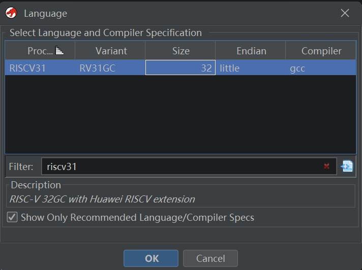
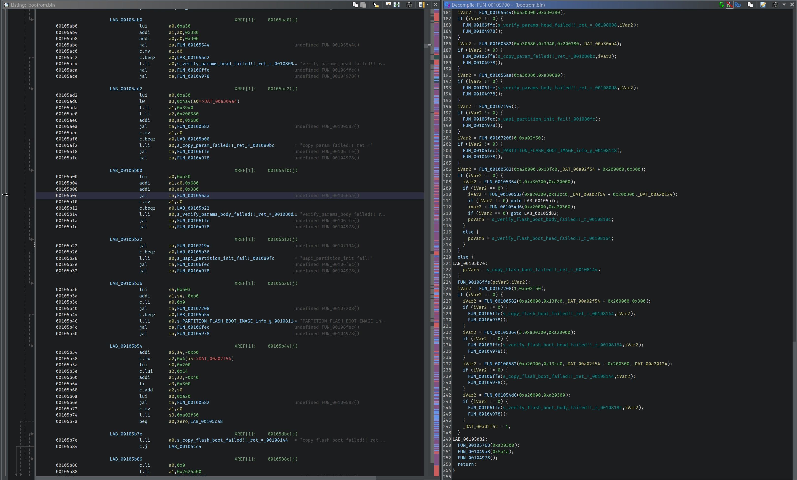

*There is no official instruction manual available for reference. The translation of the instructions is based on guesses and lacks testing, so the accuracy of the translation is not guaranteed.*

## Ghidra Huawei custom RISCV extension (RISCV31) Processor Module

- Provided support for Hi3863V100 (ws63), Hi2821, and other customized RISCV32 from HiSilicon in Ghidra.
- Supported custom instructions:
```
 riscv_push_pop_extension
   +----+----+----+----+----+----+---+---+---+---+---+---+---+---+---+---+-----------+
   | 15 | 14 | 13 | 12 | 11 | 10 | 9 | 8 | 7 | 6 | 5 | 4 | 3 | 2 | 1 | 0 |    name   |
   +----+----+----+----+----+----+---+---+---+---+---+---+---+---+---+---+-----------+
   |  1 |  0 |  0 |  sp16imm             | rcount        | 0 | 0 | 0 | 0 |  C.POP    |
   +----+----+----+----+----+----+---+---+--+---+----+---+---+---+---+---+-----------+
   |  1 |  0 |  0 |  sp16imm             | rcount        | 0 | 1 | 0 | 0 |  C.POPRET |
   +----+----+----+----+----+----+---+---+--+---+----+---+---+---+---+---+-----------+
   |  1 |  0 |  0 |  sp16imm             | rcount        | 1 | 0 | 0 | 0 |  C.PUSH   |
   +----+----+----+----+----+----+---+---+--+---+----+---+---+---+---+---+-----------+

 riscv_LLI_extension
   +-----+-----+-----+-------+-----+----+-------+----+----+---+---+------------------------+
   |47:43|42:38|       37:32 |31:17|16  | 15:12 | 11 :7   | 6 : 0 | instruction            |
   +-----+-----+-----+-------+-----+----+-------+----+----+---+---+------------------------+
   |imm[31:0]                           | 0000  | rd      |0011111| L.LI                   |
   +-----+-----+-----+-------+-----+----+-------+----+----+---+---+------------------------+

 riscv_ldst_bh_extension
   +----+----+----+----+----+----+---+---+---+----+----+---+---+---+---+---+-----------------------+
   | 15 | 14 | 13 | 12 | 11 | 10 | 9 | 8 | 7 | 6  | 5  | 4 | 3 | 2 | 1 | 0 |instruction            |
   +----+----+----+----+----+----+---+---+---+----+----+---+---+---+---+---+-----------------------+
   |  1 |  0 |  1 |  uimm[0,4:3] | rs1’      |uimm[2:1]| rs2’      | 0 | 0 | C.SB (behind C.FSD)   |
   +----+----+----+----+----+----+---+---+---+----+----+---+---+---+---+---+-----------------------+
   |  0 |  0 |  1 |  uimm[0,4:3] | rs1’      |uimm[2:1]| rd’       | 0 | 0 | C.LBU (behind C.FLD)  |
   +----+----+----+----+----+----+---+---+---+----+----+---+---+---+---+---+-----------------------+
   |  1 |  0 |  1 |  uimm[5:3]   | rs1’      |uimm[2:1]| rs2’      | 1 | 0 | C.SH (behind C.FSDSP) |
   +----+----+----+----+----+----+---+---+---+----+----+---+---+---+---+---+-----------------------+
   |  0 |  0 |  1 |  uimm[5:3]   | rs1’      |uimm[2:1]| rd’       | 1 | 0 | C.LHU (behind C.FLDSP)|
   +----+----+----+----+----+----+---+---+---+----+----+---+---+---+---+---+-----------------------+

 riscv_muladd_extension
   +----+----+----+----+----+----+----+-----+----+----+-------+----+----+----+----+----+---+---+---+---+---+------------------------+
   | 31 | 30 | 29:27        | 26:25   |24:23|    22:20| 19:15 | 14:12        | 11:9        | 8 | 7 | 6 : 0 | instruction            |
   +----+----+----+----+----+----+----+-----+----+----+-------+----+----+----+----+----+---+---+---+---+---+------------------------+
   | uimm[7:1]\ :sup:`uimm[0]=1`      | rs2           | rs1   | 101          |  rd                 |1011011| MULIADD                |
   +----+----+----+----+----+----+----+-----+----+----+-------+----+----+----+----+----+---+---+---+---+---+------------------------+
   | uimm[7:1]\ :sup:`uimm[0]=0`      | rs2           | rs1   | 001          |  rd                 |1011011| MULIADD                |
   +----+----+----+----+----+----+----+-----+----+----+-------+----+----+----+----+----+---+---+---+---+---+------------------------+

 riscv_preshifted_arithmetic
   +----+----+----+----+----+----+----+-----+----+----+-------+----+----+----+----+----+---+---+---+---+---+------------------------+
   | 31 | 30 | 29 | 28 | 27 | 26 | 25 |24:23|    22:20| 19:15 | 14 | 13 | 12 | 11 | 10 | 9 | 8 | 7 | 6 : 0 | instruction            |
   +----+----+----+----+----+----+----+-----+----+----+-------+----+----+----+----+----+---+---+---+---+---+------------------------+
   | **custom-1 encoding group**                                                                                                    |
   +----+----+----+----+----+----+----+-----+----+----+-------+----+----+----+----+----+---+---+---+---+---+------------------------+
   | shtype  | shamt                  | rs2           | rs1   | 000          |  rd                 |0011011| ADDSHF                 |
   +----+----+----+----+----+----+----+-----+----+----+-------+----+----+----+----+----+---+---+---+---+---+------------------------+
   | shtype  | shamt                  | rs2           | rs1   | 001          |  rd                 |0011011| SUBSHF                 |
   +----+----+----+----+----+----+----+-----+----+----+-------+----+----+----+----+----+---+---+---+---+---+------------------------+
   | shtype  | shamt                  | rs2           | rs1   | 010          |  rd                 |0011011| ORSHF                  |
   +----+----+----+----+----+----+----+-----+----+----+-------+----+----+----+----+----+---+---+---+---+---+------------------------+
   | shtype  | shamt                  | rs2           | rs1   | 011          |  rd                 |0011011| XORSHF                 |
   +----+----+----+----+----+----+----+-----+----+----+-------+----+----+----+----+----+---+---+---+---+---+------------------------+
   | shtype  | shamt                  | rs2           | rs1   | 100          |  rd                 |0011011| ANDSHF                 |
   +----+----+----+----+----+----+----+-----+----+----+-------+----+----+----+----+----+---+---+---+---+---+------------------------+

 riscv_longjump_extension
   +----+----+----+----+----+----+----+-----+----+----+-------+----+----+----+----+----+---+---+---+---+---+------------------------+
   | 31 | 30 | 29:27        | 26:25   |24:23|    22:20| 19:15 | 14:12        | 11:9        | 8 | 7 | 6 : 0 | instruction            |
   +----+----+----+----+----+----+----+-----+----+----+-------+----+----+----+----+----+---+---+---+---+---+------------------------+
   | imm[20,10:1,11,19:12]                                                   | imm[24:21]      | 0 |1111011| JAL16                  |
   +----+----+----+----+----+----+----+-----+----+----+-------+----+----+----+----+----+---+---+---+---+---+------------------------+
   | imm[20,10:1,11,19:12]                                                   | imm[24:21]      | 1 |1111011| J16                    |
   +----+----+----+----+----+----+----+-----+----+----+-------+----+----+----+----+----+---+---+---+---+---+------------------------+

 riscv_condbr_imm_extension
   +----+----+----+----+----+----+----+----+----+----+----+----+----+----+----+----+----+----+---+---+---+-------+--------------+
   | 31 | 30 | 29 | 28 | 27 | 26 | 25 | 24 |23:22    21:20| 19:15   | 14 | 13 | 12 | 11 | 10 | 9 | 8 | 7 | 6 : 0 | instruction  |
   +----+----+----+----+----+----+----+----+----+----+----+----+----+----+----+----+----+----+---+---+---+-------+--------------+
   | **custom-0 encoding group**           |              |                                                                     |
   +----+----+----+----+----+----+----+----+----+----+----+----+----+----+----+----+----+----+---+---+---+---+---+--------------+
   | cmpimm[7:0]                           |  offset[9:6] | rs1     | 000          | offset[5:1]         |0111011| BEQI         |
   +----+----+----+----+----+----+----+----+----+----+----+----+----+----+----+----+----+----+---+---+---+---+---+--------------+
   | cmpimm[7:0]                           |  offset[9:6] | rs1     | 001          | offset[5:1]         |0111011| BNEI         |
   +----+----+----+----+----+----+----+----+----+----+----+----+----+----+----+----+----+----+---+---+---+---+---+--------------+
   | cmpimm[7:0]                           |  offset[9:6] | rs1     | 100          | offset[5:1]         |0111011| BLTI         |
   +----+----+----+----+----+----+----+----+----+----+----+----+----+----+----+----+----+----+---+---+---+---+---+--------------+
   | cmpimm[7:0]                           |  offset[9:6] | rs1     | 101          | offset[5:1]         |0111011| BGEI         |
   +----+----+----+----+----+----+----+----+----+----+----+----+----+----+----+----+----+----+---+---+---+---+---+--------------+
   | cmpimm[7:0]                           |  offset[9:6] | rs1     | 110          | offset[5:1]         |0111011| BLTUI        |
   +----+----+----+----+----+----+----+----+----+----+----+----+----+----+----+----+----+----+---+---+---+---+---+--------------+
   | cmpimm[7:0]                           |  offset[9:6] | rs1     | 111          | offset[5:1]         |0111011| BGEUI        |
   +----+----+----+----+----+----+----+----+----+----+----+----+----+----+----+----+----+----+---+---+---+---+---+--------------+

 uxth & uxtb
   +----+----+----+----+----+----+---+---+---+---+---+---+---+---+---+---+-----------+
   | 15 | 14 | 13 | 12 | 11 | 10 | 9 | 8 | 7 | 6 | 5 | 4 | 3 | 2 | 1 | 0 |    name   |
   +----+----+----+----+----+----+---+---+---+---+---+---+---+---+---+---+-----------+
   |  1 |  0 |  0 |  1 |  1 |       rd       | 0 | 1 | 0 | 0 | 0 | 0 | 1 |   UXTH    |
   +----+----+----+----+----+----+---+---+--+---+----+---+---+---+---+---+-----------+
   |  1 |  0 |  0 |  1 |  1 |       rd       | 0 | 0 | 0 | 0 | 0 | 0 | 1 |   UXTB    |
   +----+----+----+----+----+----+---+---+--+---+----+---+---+---+---+---+-----------+

 stmia & ldmia
   +----+----+----+----+----+----+----+----+----+----+----+----+---------+----+----+----+----+----+---+---+---+-------+----------------+
   | 31 | 30 | 29 | 28 | 27 | 26 | 25 | 24 | 23 | 22 | 21 | 20 | 19 : 15 | 14 | 13 | 12 | 11 | 10 | 9 | 8 | 7 | 6 : 0 | instruction    |
   +----+----+----+----+----+----+----+----+----+----+----+----+---------+----+----+----+----+----+---+---+---+-------+----------------+
   | 0  |s11 |s10 | s9 | s8 | s7 | s6 | s5 | s4 | s3 | s2 | 0  |   rs1   | 001          | a0 | s1 |s0 |sp |ra |0001011| STMIA          |
   +----+----+----+----+----+----+----+----+----+----+----+----+---------+----+----+----+----+----+---+---+---+-------+----------------+
   | 0  |s11 |s10 | s9 | s8 | s7 | s6 | s5 | s4 | s3 | s2 | 0  |   rs1   | 000          | a0 | s1 |s0 |sp |ra |0001011| LDMIA          |
   +----+----+----+----+----+----+----+----+----+----+----+----+---------+----+----+----+----+----+---+---+---+-------+----------------+

```

## Screenshots




## Installation
- Copy this project to the `\Ghidra\Processors\` directory.

## References

- [Ghidra RISCV Processor Module](https://github.com/NationalSecurityAgency/ghidra/tree/master/Ghidra/Processors/RISCV)
- [RISC-V Code Size Reduction](https://github.com/riscvarchive/riscv-code-size-reduction/tree/main/existing_extensions/Huawei%20Custom%20Extension)